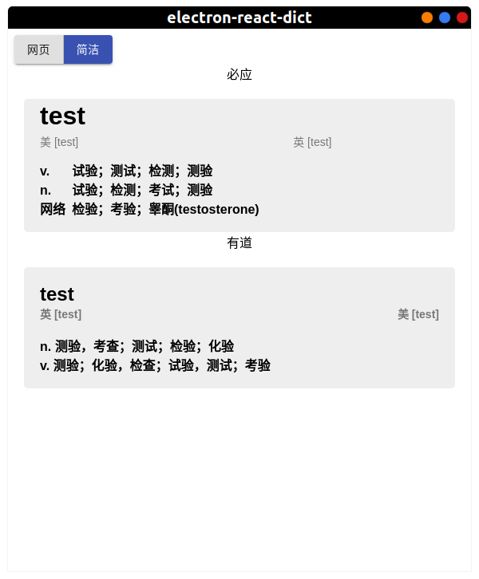
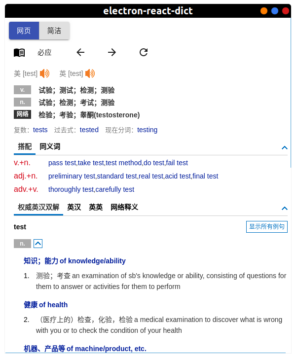
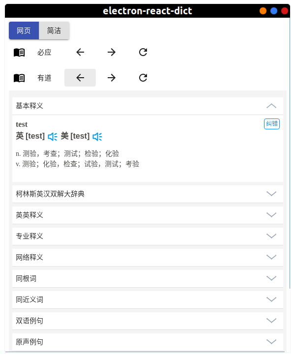
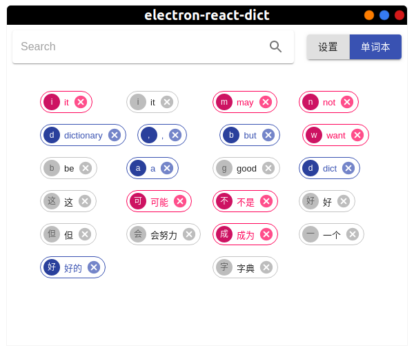
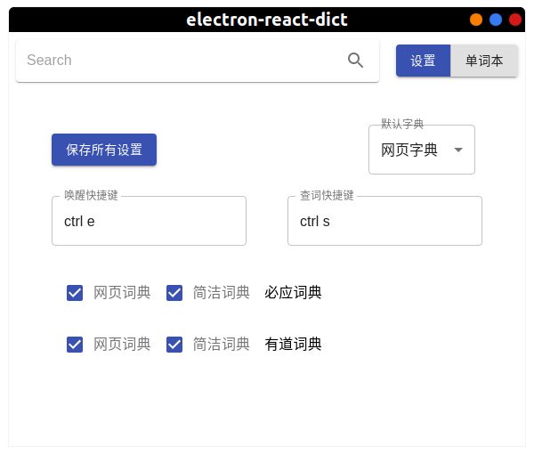
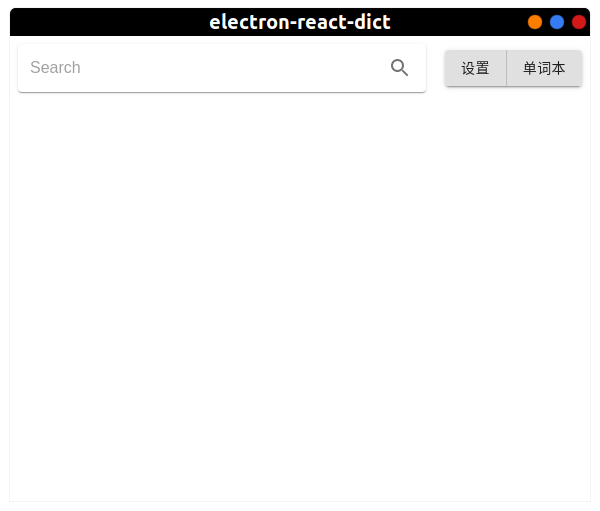

一个简单的字典 for linux

**power by electron react**

这可能不是一款好的字典,但会努力成为好的字典
 
### 使用 

选中 (默认ctrl + s查词)

### 简洁字典

### 网页字典

### 单词本

### 配置

### 主页

## Todo

- ocr
- 自定义添加网页词典
- 多语言
- 全局监听,弹出翻译logo
- 单词本导出
- mdx解析
- 日志

## 致谢

[electron-react-boilerplate](https://github.com/electron-react-boilerplate/electron-react-boilerplate)
